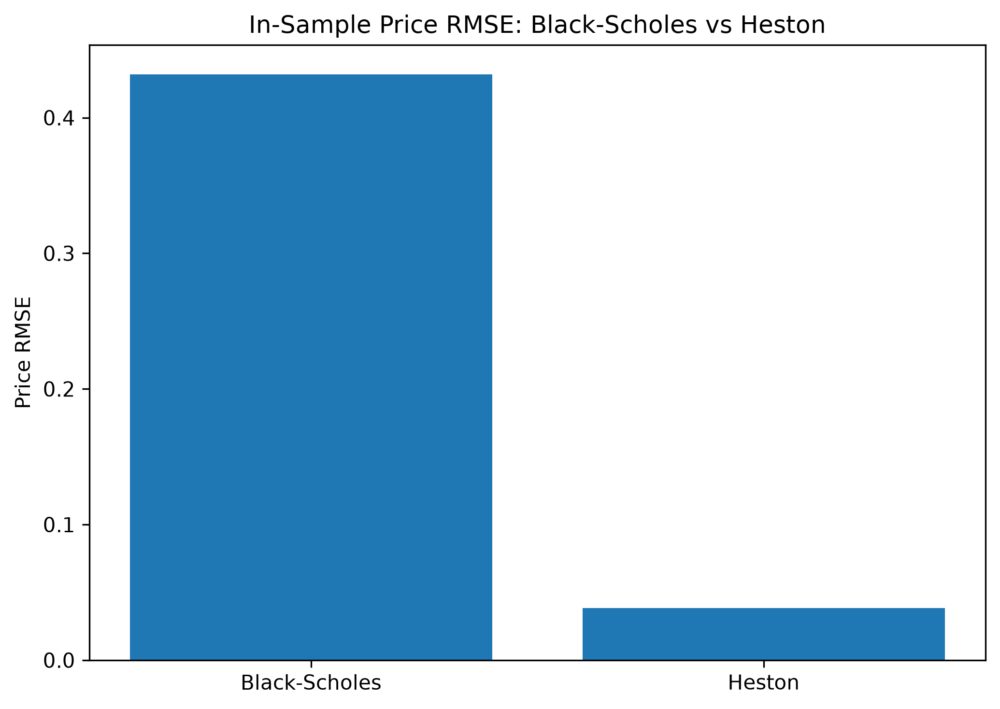
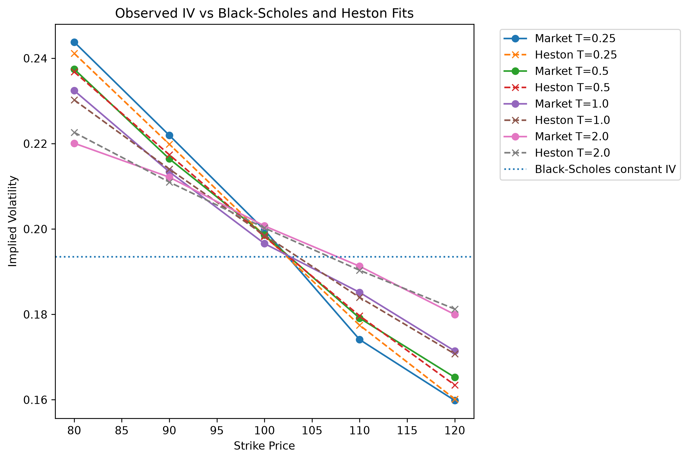
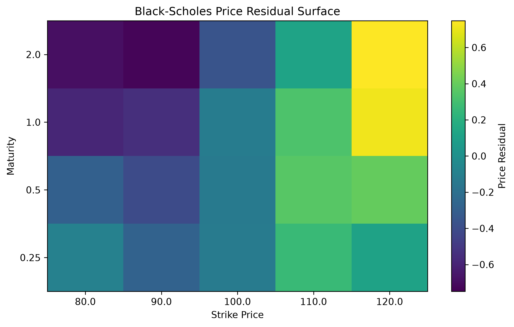
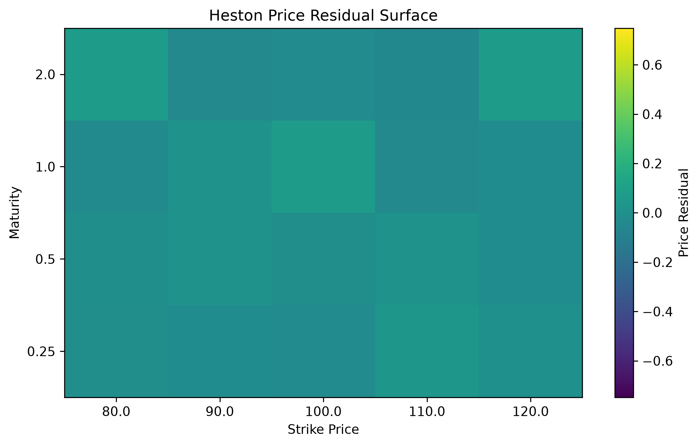

# Derivatives Pricing and Model Calibration

## A Comparative Study of Analytical, Simulation, PDE and Stochastic Volatility Methods

This project develops a structured framework for derivative pricing, numerical validation, volatility diagnostics, stochastic-volatility modeling, calibration, and model comparison.

Rather than treating option pricing as a collection of isolated formulas, the project follows a sequential research workflow:

**Analytical benchmark → Numerical pricing → Numerical validation → Volatility diagnosis → Stochastic-volatility extension → Calibration → Model comparison**

The central objective is to distinguish two fundamentally different sources of pricing error:

1. **Numerical error** arising from simulation, discretization, or numerical integration.
2. **Model-specification error** arising when the assumptions of a pricing model are unable to reproduce the structure of an option surface.

The project begins with the Black-Scholes model as an analytical benchmark, validates Monte Carlo and finite-difference methods against this benchmark, examines implied-volatility patterns that expose the limitations of constant volatility, introduces the Heston stochastic-volatility model, and finally compares calibrated Black-Scholes and Heston models on the same controlled quasi-market option surface.

---

## Research Questions

This project addresses the following questions:

- How accurately can numerical pricing methods reproduce an analytical Black-Scholes benchmark?
- How should Monte Carlo sampling error and finite-difference discretization error be measured and interpreted?
- What information does the implied-volatility surface reveal about model misspecification?
- How does stochastic volatility change option-price and implied-volatility behavior?
- Can Heston prices be independently validated using both semi-analytical Fourier pricing and Monte Carlo simulation?
- How reliably can Heston parameters be recovered through calibration?
- Does a good pricing fit necessarily imply accurate or uniquely identified model parameters?
- Once numerical errors have been reduced to a sufficiently small level for comparison, how much remaining pricing error can be attributed to model specification?

---

## Project Workflow

The project is organized as eight sequential notebooks.

| Notebook | Topic | Main Objective |
|---|---|---|
| `01_black_scholes_greeks.ipynb` | Black-Scholes Pricing and Greeks | Establish an analytical benchmark and study price sensitivities |
| `02_monte_carlo.ipynb` | Monte Carlo Pricing | Estimate option prices under risk-neutral simulation and quantify sampling uncertainty |
| `03_finite_difference.ipynb` | Crank-Nicolson Finite Difference | Solve the Black-Scholes PDE numerically and study convergence and discretization error |
| `04_implied_volatility.ipynb` | Implied Volatility | Recover implied volatility and diagnose volatility skew and surface structure |
| `05_heston_model.ipynb` | Heston Dynamics | Simulate stochastic variance and study the roles of Heston parameters |
| `06_heston_pricing.ipynb` | Heston Pricing | Implement characteristic-function/Fourier pricing and validate it against Monte Carlo |
| `07_heston_calibration.ipynb` | Heston Calibration | Calibrate model parameters and investigate fit quality and parameter identifiability |
| `08_model_comparison.ipynb` | Black-Scholes vs Heston | Compare model fit and residual structure on the same controlled quasi-market surface |

---

## 1. Black-Scholes Analytical Benchmark

The Black-Scholes model provides the deterministic benchmark used throughout the first part of the project.

The implementation includes European call and put pricing together with key Greeks. Analytical prices provide a reference against which later numerical methods can be evaluated.

This distinction is important because a discrepancy between a numerical price and the Black-Scholes benchmark can initially be interpreted as **numerical approximation error**, rather than model-specification error.

---

## 2. Monte Carlo Pricing

The second stage prices European options through risk-neutral Monte Carlo simulation.

The implementation includes:

- simulation of terminal stock prices under geometric Brownian motion,
- discounted payoff estimation,
- Monte Carlo standard errors,
- convergence analysis,
- repeated simulation experiments,
- antithetic variates for variance reduction.

The experiments emphasize that a single Monte Carlo estimate should not be interpreted in isolation. Sampling uncertainty must be quantified using standard errors and repeated experiments.

This establishes the first major source of numerical error in the project:

**Monte Carlo sampling error.**

---

## 3. Finite-Difference Pricing

The Black-Scholes partial differential equation is solved using the Crank-Nicolson finite-difference method.

The numerical solution is compared directly with the analytical Black-Scholes benchmark.

The notebook studies how pricing error changes as the spatial and temporal grids are refined and demonstrates approximately second-order convergence under the configurations examined.

Monte Carlo and finite-difference pricing are subsequently compared using error measures rather than individual price realizations.

This introduces a second major source of numerical error:

**spatial and temporal discretization error.**

---

## 4. Implied Volatility as a Model Diagnostic

The project then moves from numerical accuracy to model diagnosis.

A Brent root-finding procedure is used to recover Black-Scholes implied volatility from option prices.

Synthetic option surfaces are used to examine volatility skew and maturity-dependent implied-volatility patterns.

A constant-volatility Black-Scholes model cannot reproduce a non-flat implied-volatility surface. The resulting systematic pricing residuals demonstrate that even a numerically exact implementation may still generate economically meaningful pricing errors when the model assumptions are too restrictive.

This marks the transition from:

**numerical error → model-specification error**

---

## 5. Heston Stochastic Volatility Model

To relax the constant-volatility assumption, the project introduces the Heston stochastic-volatility model.

Variance follows a mean-reverting square-root process, while stock-price and variance shocks may be correlated.

The simulation experiments investigate the effects of:

- initial variance,
- mean-reversion speed,
- long-run variance,
- volatility of variance,
- spot-volatility correlation.

The notebook also examines the Feller condition, mean-reversion behavior, stochastic-variance paths, and the effect of Heston parameters on return distributions.

The simulations use a positivity-truncated Euler approximation for the variance process together with a log-Euler update for the stock price.

---

## 6. Heston Pricing and Independent Numerical Validation

European options under the Heston model are priced using a semi-analytical characteristic-function approach with numerical Fourier integration.

A separate Heston Monte Carlo implementation is retained as an independent stochastic benchmark.

This produces two conceptually different pricing engines:

- **Fourier pricing:** deterministic and calibration-ready.
- **Monte Carlo pricing:** stochastic numerical benchmark.

For the baseline parameter configuration, the Fourier call price is approximately:

```text
10.3942
```

while the Monte Carlo estimate is approximately:

```text
10.3785
```

with the Fourier price lying inside the corresponding Monte Carlo confidence interval.

The notebook also studies:

- characteristic-function consistency,
- Fourier integration stability,
- Monte Carlo time-step sensitivity,
- implied-volatility skew,
- the effect of correlation on implied volatility,
- the effect of volatility of variance,
- maturity-dependent volatility structure.

The Monte Carlo experiments show that, at the simulation precision used in the notebook, sampling variation dominates the detectable time-discretization effect. This should not be interpreted as evidence that Euler discretization error is absent.

---

## 7. Heston Calibration and Parameter Identification

The Heston model is calibrated by minimizing pricing residuals over the parameter vector:

```text
(v0, kappa, theta, xi, rho)
```

using bounded nonlinear least squares.

Calibration is first performed on a noise-free synthetic option surface generated using the same Heston pricing engine.

Under this idealized experiment, the calibration achieves near-machine-precision pricing accuracy, providing a useful implementation-level validation of the calibration pipeline.

The analysis is then extended using:

- multiple initial parameter guesses,
- noisy implied-volatility observations,
- price residual diagnostics,
- implied-volatility residual diagnostics,
- Jacobian-based local sensitivity analysis,
- singular-value diagnostics.

A central finding is that:

**good pricing fit does not necessarily imply exact parameter recovery or unique parameter identification.**

When observation noise is introduced, multiple parameter configurations may produce similarly small pricing errors even when individual parameters differ materially.

This distinction between **fit quality** and **parameter identification** is important when interpreting calibrated stochastic-volatility models.

---

## 8. Black-Scholes vs Heston Model Comparison

The final empirical comparison evaluates:

- a best-fit constant-volatility Black-Scholes model,
- a calibrated five-parameter Heston model,

on exactly the same controlled quasi-market option surface.

The quasi-market surface is generated from Heston prices, transformed into implied volatilities, perturbed using small controlled volatility noise, and converted back into option prices.

This experimental design allows model flexibility to be compared under a controlled environment while avoiding the additional complications of real-market data cleaning.

### Price-Fit Results

The best-fit constant-volatility Black-Scholes model produces approximately:

```text
Price RMSE = 0.4320
Price MAE  = 0.3708
```

The calibrated Heston model produces approximately:

```text
Price RMSE = 0.0384
Price MAE  = 0.0315
```

This corresponds to approximately:

```text
91.11% reduction in in-sample price RMSE
91.51% reduction in in-sample price MAE
```

under the controlled quasi-market experiment.



### Implied-Volatility Fit

The Black-Scholes model produces approximately:

```text
IV RMSE = 0.0247
IV MAE  = 0.0207
```

while Heston produces approximately:

```text
IV RMSE = 0.0016
IV MAE  = 0.0014
```

corresponding to approximately:

```text
93.52% reduction in in-sample IV RMSE
93.44% reduction in in-sample IV MAE
```



### Residual Structure

The distinction between the two models is not only visible in aggregate RMSE.

Black-Scholes residuals exhibit a systematic strike-dependent pattern, indicating that a single volatility parameter cannot reproduce the curvature of the quasi-market option surface.



By contrast, calibrated Heston residuals remain much smaller and more irregular around zero under the same comparison.



The two residual heatmaps are plotted using the same residual scale to ensure a visually meaningful comparison.

These results illustrate the central theme of the project:

> Once numerical pricing errors have been reduced to a level sufficiently small for the present comparison, systematic residual structure can reveal limitations of the pricing model itself.

The comparison is **in-sample** and is performed on a **controlled quasi-market surface**. It should therefore be interpreted as a model-fitting experiment rather than evidence of superior out-of-sample predictive performance.

---

## Numerical Error vs Model Error

The project progressively separates several distinct sources of error.

| Source | Example |
|---|---|
| Sampling error | Monte Carlo pricing |
| Spatial discretization error | Finite-difference grid |
| Temporal discretization error | PDE and Heston simulation |
| Numerical integration error | Heston Fourier pricing |
| Calibration error | Imperfect optimizer fit |
| Observation noise | Perturbed quasi-market implied volatilities |
| Model-specification error | Constant-volatility Black-Scholes residual structure |

This distinction is central to the project.

A pricing discrepancy should not automatically be interpreted as evidence that a financial model is wrong. Numerical approximation error must first be understood and controlled sufficiently for the intended comparison.

Conversely, a highly accurate numerical solver cannot correct a structurally misspecified financial model.

---

## Repository Structure

```text
derivatives-pricing-calibration/
│
├── src/
│   ├── models/
│   │   ├── black_scholes.py
│   │   └── heston.py
│   ├── pricing/
│   │   ├── monte_carlo.py
│   │   ├── finite_difference.py
│   │   └── heston_pricing.py
│   ├── volatility/
│   │   └── implied_volatility.py
│   ├── calibration/
│   │   └── heston_calibration.py
│   └── comparison/
│       └── model_comparison.py
│
├── notebooks/
│   ├── 01_black_scholes_greeks.ipynb
│   ├── 02_monte_carlo.ipynb
│   ├── 03_finite_difference.ipynb
│   ├── 04_implied_volatility.ipynb
│   ├── 05_heston_model.ipynb
│   ├── 06_heston_pricing.ipynb
│   ├── 07_heston_calibration.ipynb
│   └── 08_model_comparison.ipynb
│
├── tests/
│   ├── test_black_scholes.py
│   ├── test_monte_carlo.py
│   ├── test_finite_difference.py
│   ├── test_implied_volatility.py
│   ├── test_heston.py
│   ├── test_heston_pricing.py
│   ├── test_heston_calibration.py
│   ├── test_heston_calibration_extra.py
│   └── test_model_comparison.py
│
├── data/
├── figures/
├── requirements.txt
├── pytest.ini
└── README.md
```

---

## Reproducibility

The project was developed using Python 3.13.

Install the project dependencies with:

```bash
pip install -r requirements.txt
```

Run the automated test suite with:

```bash
pytest -q
```

At the current project stage, the test suite contains:

```text
35 passing tests
```

The eight notebooks are designed to be read sequentially from `01` to `08`.

Each notebook has been fully executed and checked for saved runtime errors.

---

## Key Python Tools

The core numerical stack consists of:

- NumPy for numerical computation and simulation,
- SciPy for probability distributions, integration, optimization, and root finding,
- pandas for calibration and comparison datasets,
- Matplotlib for visualization,
- pytest for automated validation,
- Jupyter for the research notebooks.

---

## Limitations

This project is designed primarily as a controlled numerical and modeling study rather than a production derivatives-pricing system.

Important limitations include:

- the option experiments assume a constant risk-free rate,
- the current pricing setup does not explicitly model dividends or a general carry term,
- the final comparison uses a controlled quasi-market surface rather than live market option data,
- bid-ask spreads, liquidity filters, transaction costs, and market microstructure effects are not modeled,
- the Heston Fourier implementation prioritizes transparency and educational clarity rather than production-level calibration speed,
- the Heston Monte Carlo scheme uses a positivity-truncated Euler approximation and therefore retains time-discretization error,
- strong in-sample calibration performance does not imply out-of-sample predictive superiority,
- fitted Heston parameters may remain weakly identified even when pricing errors are small.

These limitations provide natural directions for future extensions using market data, richer carry structures, improved simulation schemes, faster characteristic-function implementations, and out-of-sample calibration analysis.

---

## Main Takeaway

The central conclusion of the project is not simply that one option-pricing model produces a lower RMSE than another.

The broader result is methodological:

**numerical accuracy and model adequacy are different problems.**

Monte Carlo simulation, finite-difference methods, and numerical Fourier integration determine how accurately a chosen model is solved.

Implied-volatility diagnostics, calibration residuals, and cross-model comparisons determine whether the model itself is sufficiently flexible to represent the option surface.

By progressing from analytical benchmarking to numerical validation and finally to stochastic-volatility calibration, this project demonstrates how these two sources of error can be studied separately and then connected within a single derivatives-pricing framework.
